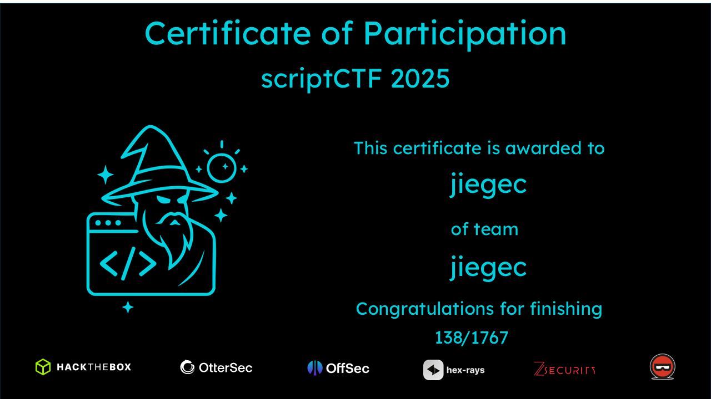

# scriptCTF 2025

Link: <https://play.scriptsorcerers.xyz/>

CTFTime: <https://ctftime.org/event/2792>

Official writeup: <https://github.com/scriptCTF/scriptCTF2025-OfficialWriteups/>

Result: 4975 Points, 139th Place

Solved Challenges:

OSINT:

- [The Insider](./the-insider.md)
- [The Insider 3](./the-insider-3.md)

Crypto:

- [EaaS](./eaas.md)
- [Mod](./mod.md)
- [RSA-1](./rsa-1.md)
- [Secure-Server](./secure-server.md)
- [Secure-Server-2](./secure-server-2.md)

Reverse:

- [Plastic Shield](./plastic-shield.md)

Pwn:

- [Index](./index.md)
- [Index-2](./index-2.md)

Misc:

- [Div](./div.md)
- [Div 2](./div2.md)
- [Enchant](./enchant.md)
- [Read The Rules](./read-the-rules.md)
- [Subtract](./subtract.md)
- [emoji](./emoji.md)

Forensics:

- [Just Some Avocado](./just-some-avocado.md)
- [pdf](./pdf.md)
- [diskchal](./diskchal.md)

Programming:

- [Sums](./sums.md)

Web:

- [Renderer](./renderer.md)

Not solved challenges, but worth a writeup:

- [Plastic Shield 2](./plastic-shield-2.md)
