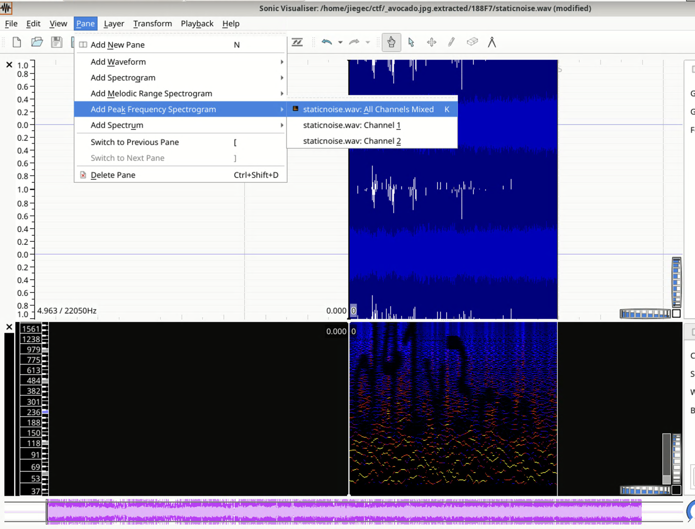

# Just Some Avocado

An image is provided. Run binwalk:

```shell
$ binwalk -e avocado.jpg

DECIMAL       HEXADECIMAL     DESCRIPTION
--------------------------------------------------------------------------------
100599        0x188F7         Zip archive data, encrypted at least v1.0 to extract, compressed size: 234, uncompressed size: 222, name: justsomezip.zip
100922        0x18A3A         Zip archive data, encrypted at least v2.0 to extract, compressed size: 408140, uncompressed size: 437908, name: staticnoise.wav

WARNING: One or more files failed to extract: either no utility was found or it's unimplemented
```

Got an encrypted zip, use fcrackzip to find its password:

```shell
$ fcrackzip -u -D -p ~/rockyou.txt _avocado.jpg.extracted/188F7.zip"
PASSWORD FOUND!!!!: pw == impassive3428
```

Unzip the `188F7.zip`, got two files:

- justsomezip.zip: yet another encrypted zip
- staticnoise.wav: hint for the new password

The `staticnoise.wav` suggests that the password cannot be bruteforced easily:

```shell
$ ffprobe -i staticnoise.wav
Input #0, wav, from 'staticnoise.wav':
  Metadata:
    comment         : What if my password isn't on rockyou.txt
    encoder         : Lavf61.7.100
  Duration: 00:00:04.96, bitrate: 705 kb/s
```

Open `staticnoise.wav` in [Sonic Visualizer](https://www.sonicvisualiser.org/), display its peak frequency spectrogram:



The password is `d41v3ron`. Decompress the `justsomezip.zip` got the flag: `scriptCTF{1_l0ve_d41_v3r0n}`
