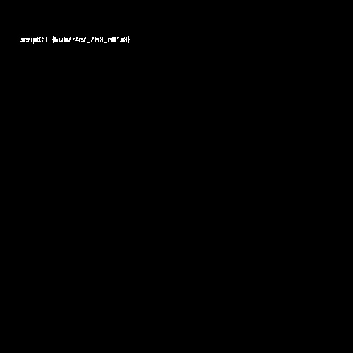

# Subtract

```
The image size is 500x500. You might want to remove some stuff... Note: Some may call it guessy!
```

The given file contains coordinates. My first attempt is to draw all the points on the image, but the points covered the whole picture:

```python
import numpy as np
from PIL import Image

# Create a 500x500x3 array of 8 bit unsigned integers
data = np.zeros((500, 500, 3), dtype=np.uint8)

found = dict()
for line in open("coordinates.txt", "r", encoding="utf-8"):
    x = int(line.split()[0][1:-1])
    y = int(line.split()[1][:-1])
    data[x, y] = [255, 255, 255]

image = Image.fromarray(data)
image.show()
```

But I found that the coordinates file contains 250573 rows, more than 500*500. So some points must have appeared more than once:

```python
import numpy as np
from PIL import Image

# Create a 500x500x3 array of 8 bit unsigned integers
data = np.zeros((500, 500, 3), dtype=np.uint8)

found = dict()
for line in open("coordinates.txt", "r", encoding="utf-8"):
    x = int(line.split()[0][1:-1])
    y = int(line.split()[1][:-1])

    if (x, y) not in found:
        found[(x, y)] = 1
    else:
        data[x, 500 - 1 - y] = [255, 255, 255]

image = Image.fromarray(data)
image.show()
```

The generated image:



The flag seems to be `scriptCTF{6ub7r4c7_7h3_n01s3}` but it was incorrect. Guessing it is a leet speek, so `6ub7r4c7` should be `subtract`. After some attempts, the correct flag is `scriptCTF{5ub7r4c7_7h3_n01s3}`.

It is also hinted by @NoobMaster in Discord: `For Misc/Subtract the first character is a 5 (its confusing so)`.
