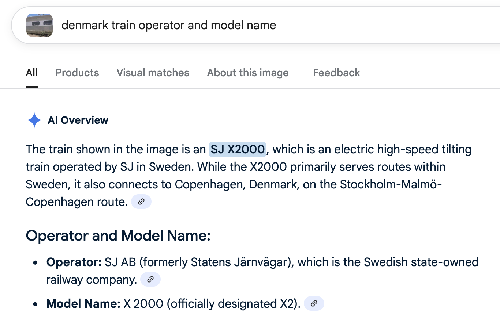

# Train Mania

```
Difficulty: Easy
Author: Quack

I recently stumpled upon this cool train! But I'd like to know a bit more about it... Can you please tell me the operating company, model number and its maximum service speed (km/h in regular traffic)?

The flag format is brunner{OPERATOR-MODELNUMBER-SERVICESPEED}.
So if the operator you have found is DSB, the model number RB1, and the maximum service speed is 173 km/h, the flag would be brunner{DSB-RB1-173}.
```

A video is provided in the attachment. Take a snapshot, and ask AI:



The operator is `SJ`, the model name is `X2`. From [Wikipedia](https://en.wikipedia.org/wiki/X_2000), the top commercial speed is 200 km/h.

So the flag is: `brunner{SJ-X2-200}`.
