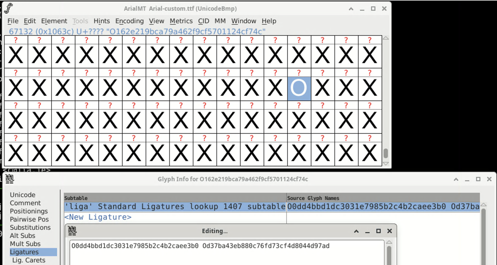

# FONT LEAGUES

```
This time, YOU give me the flag
```

In attachment, a `Arial-custom.ttf` is found. An html is provided:

```html
<!DOCTYPE html>
<html lang="en">
<head>
    <meta charset="UTF-8">
    <meta name="viewport" content="width=device-width, initial-scale=1.0">
    <title>Enter the flag. You will get an O if it is correct.</title>
    <style>
        @font-face {
            font-family: 'Arial-custom';
            src: url('Arial-custom.ttf') format('truetype');
        }
        textarea {
            font-family: 'Arial-custom', sans-serif;
            width: 100%;
            height: 200px;
            font-size: 16px;
        }
    </style>
</head>
<body>
    <h1>Enter the flag. You will get an O if it is correct. Put it in the TFCCTF{...} format before submitting</h1>
    <textarea placeholder="Type here..."></textarea>
</body>
</html>
```

It means that if we input the flag, it will be displayed as `O`. Simple testing reveals that, it replaces two hex characters into one `X`. It is using the font ligature feature.

Open the font in fontforge, we can find there is an `O` glyph (named `O162e219bca79a462f9cf5701124cf74c`) hanging in the middle of many `X`s:



And it has ligatures configured: it can be expanded from two another glyphs: `O0dd4bbd1dc3031e7985b2c4b2caee3b0` and `Od37ba43eb880c76fd73cf4d8044d97ad`. We can do this recursively to find the original characters used to generate the glyph sequence.

To find the ligature mappings in Python, we used `ttx` from fonttools to extract:

```shell
pip3 install fonttools
ttx -t GSUB Arial-custom.ttf
```

In the generated file, the mapping described above is written as:

```xml
      <Lookup index="1407">
        <LookupType value="4"/>
        <LookupFlag value="0"/>
        <!-- SubTableCount=1 -->
        <LigatureSubst index="0">
          <LigatureSet glyph="O0dd4bbd1dc3031e7985b2c4b2caee3b0">
            <Ligature components="Od37ba43eb880c76fd73cf4d8044d97ad" glyph="O162e219bca79a462f9cf5701124cf74c"/>
          </LigatureSet>
        </LigatureSubst>
      </Lookup>
```

So we need to recursively expand `Ligature.glyph` into `LigatureSet.glyph` plus `Ligature.components` in python:

```python
# pip3 install untangle
import untangle

font = untangle.parse('Arial-custom.ttx')
mapping = dict()
for lig in font.ttFont.GSUB.LookupList.Lookup:
    key1 = lig.children[2].children[0]['glyph']
    key2 = lig.children[2].children[0].children[0]['components']
    val = lig.children[2].children[0].children[0]['glyph']
    mapping[val] = (key1, key2)

target = "O162e219bca79a462f9cf5701124cf74c"

numbers = {
    "one": 1,
    "two": 2,
    "three": 3,
    "four": 4,
    "five": 5,
    "six": 6,
    "seven": 7,
    "eight": 8,
    "nine": 9,
    "zero": 0,
}

def get(a):
    if a in mapping:
        key1, key2 = mapping[a]
        return get(key1) + get(key2)
    else:
        if a in numbers:
            return str(numbers[a])
        else:
            return a

print(get(target))
```

Get flag: `TFCCTF{1f89a957a0816e3bea3fa026cd9a47cf181fb2c0e0c9e9442a2c783b01c083d2}`.

The technique is learned from <https://github.com/FFCrewCTF/ctf-writeups/blob/master/2016-11-04-hackthevote/for_250/README.md>.
