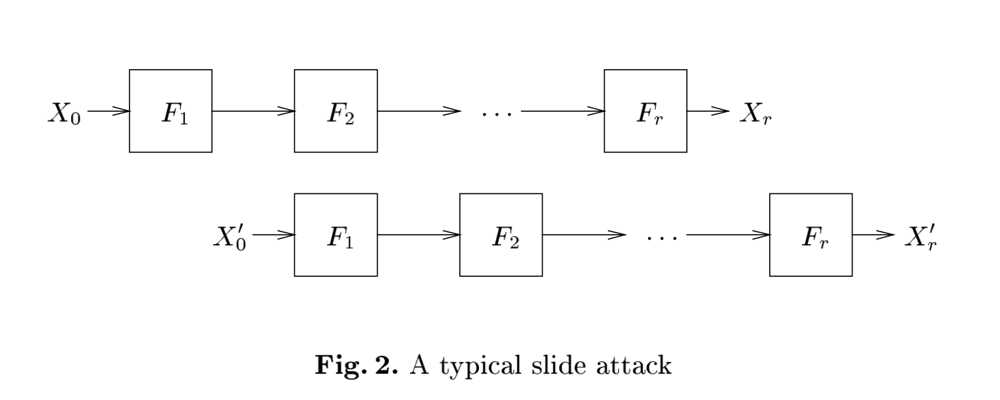

# Narrow DES

```
I came up with this slender DES variant that is made for a 48 bit architecture.

Hint: the flag is the key in hex, wrapped in ENO{...}

new hint: We could have done a thousand rounds and the attack would not get more difficult.

The running time of a solution script is rather measured in minutes, instead of seconds.
nc 52.59.124.14 5031 
```

This is my first time to get First Blood and the only solve.

Attachment contains the following code:


```c
#include <stdio.h>
#include <stdlib.h>
#include <stdint.h>
#include <string.h>

#define LB32_MASK   0x00000000ffffffff
#define LB24_MASK   0x0000000000ffffff
#define ROUNDS 32

/* Post S-Box permutation */
static char P[] = {
	8, 18, 3, 2, 15, 24, 10, 14, 20, 7, 5, 13, 1, 6, 21, 9, 4, 11, 23, 22, 12, 19, 16, 17
};

/* The S-Box tables */
static char S[8][16] = {{
	5, 3, 0, 2, 7, 1, 4, 6,
	1, 6, 4, 7, 5, 0, 3, 2,
}, {
	4, 1, 0, 5, 3, 7, 6, 2,
	1, 4, 0, 5, 2, 6, 3, 7,
}, {
	3, 4, 2, 0, 7, 6, 1, 5,
	3, 7, 6, 0, 4, 2, 1, 5,
}, {
	5, 6, 4, 2, 7, 0, 3, 1,
	6, 5, 7, 2, 1, 3, 4, 0,
}, {
	5, 6, 7, 3, 1, 0, 4, 2,
	3, 6, 2, 1, 7, 4, 0, 5,
}, {
	0, 3, 1, 4, 6, 5, 2, 7,
	0, 3, 5, 4, 7, 6, 1, 2,
}, {
	6, 0, 4, 2, 3, 5, 1, 7,
	0, 6, 7, 3, 2, 1, 4, 5,
}, {
	0, 5, 6, 2, 3, 7, 4, 1,
	2, 4, 0, 7, 3, 1, 5, 6,
}};

uint64_t des(uint64_t msg, uint64_t key, char mode) {
	
	int i, j;
	
	uint32_t L        = 0;
	uint32_t R        = 0;
	uint32_t expanded = 0;
	uint32_t s_output = 0;
	uint32_t p_output = 0;
	uint32_t temp     = 0;
	
	uint32_t sub_key[2] = {0};
	
	L = (uint32_t)((msg >> 24) & LB24_MASK);
	R = (uint32_t)(msg & LB24_MASK);
	
	/* Calculation of the 16 keys */
	sub_key[0] = (uint32_t)(key >> 32);
	sub_key[1] = (uint32_t)(key & LB32_MASK);
	
	for (i = 0; i < ROUNDS; i++) {
		expanded = 0;
		for (j = 0; j < 7; j++) {
			expanded |= ((R >> (20 - 3*j)) & 0xf) << (28 - 4*j);
		}
		expanded |= (R & 7) << 1 | (R >> 23);
		
		if (mode == 'd') {
			expanded = expanded ^ sub_key[(i+1) % 2];
		} else {
			expanded = expanded ^ sub_key[i % 2];
		}
		
		s_output = 0;
		for (j = 0; j < 8; j++) {
			temp = (expanded >> (4*j)) & 0xf;
			s_output <<= 3;
			s_output |= (uint32_t) (S[j][temp]);
		}
		
		p_output = 0;
		for (j = 0; j < 24; j++) {
			p_output <<= 1;
			p_output |= (s_output >> (24 - P[j])) & 1;
		}
		
		temp = R;
		R = L ^ p_output;
		L = temp;
	}
	return ((uint64_t) L) << 24 | R;
}

int main(int argc, const char * argv[]) {
	char inputStr[769];
	uint64_t key = 0x00000000;
	printf("Give your message in hexadecimal.\n");
	fflush(stdout);
	uint64_t input, result;
	char msg[13];
	msg[12] = 0;
	while(1) {
		scanf("%768s" , inputStr);
		for(int i = 0; i < 64; i++) {
			memcpy(msg, inputStr + 12*i, 12);
			input = (uint64_t)strtoull(msg, NULL, 16);
			result  = des(input,  key, 'e');
			printf("%012lx", result);
		}
		printf("\n");
		fflush(stdout);
	}
	exit(0);
}
```


The code implements a custom DES implementaion that:

1. Uses a 64-bit key, where the lower/higher 32 bits are used for the subkeys in turn
2. Encrypts/decrypts user-provided 48-bit data for 32 rounds

It is prone to [Slide Attack Section 4 Modified DES Example: 2K-DES](https://www.cs.berkeley.edu/~daw/papers/slide-fse99.ps), due to the way how subkeys are used:

1. If we refer to the lower 32 bits of the 64-bit key as `key1`, the higher 32 bits as `key0`, then the custom DES implementation is essentially doing the Feistel computation for 32 rounds with `key0, key1, key0, key1, ..., key0, key1`
2. Choose a input (anything is okay), and send it to the server, so we know the result after 32 roudns of Feistel computation with `key0, key1, key0, key1, ..., key0, key1`
3. By enumerating 32-bit `key1`, we can go one step back, to compute the Feistel computation for 31 rounds without the last key1: `key0, key1, key0, key1, ..., key0`
4. Then, we send the value to the server to ask it to encrypt the value. The server encrypts it by running 32 rounds of Feistel computation with `key0, key1, key0, key1, ..., key0, key1`.
5. Since the Feistel computation is reversible/cancelable (due to its XOR nature), the keys cancel out: `key0, key1, key0, key1, ..., key0, key0, key1, key0, key1, ..., key0, key1` becomes `key1`, so the result is only one step from the original input
6. We can verify that, if the result is actually one step from the original input given `key1` (also utilize the fact that `R` becomes next `L` in the Feistel computation to speed up), we know a possible `key1`. Then, we can bruteforce 32-bit `key2`.

The process is shown in the following figure, taken from [Slide Attack Figure 2](https://www.cs.berkeley.edu/~daw/papers/slide-fse99.ps):



We are going forward 32 steps, back for one step, back for 32 steps and verify that going one step forward gives us the correct answer.

Let's make a proof of concept locally, by using a small key (`0x00004321 || 0x00005678`) and attack locally:


```c
#include <assert.h>
#include <stdint.h>
#include <stdio.h>
#include <stdlib.h>
#include <string.h>
#include <time.h>

#define LB32_MASK 0x00000000ffffffff
#define LB24_MASK 0x0000000000ffffff
#define ROUNDS 32

/* Post S-Box permutation */
static char P[] = {8, 18, 3,  2, 15, 24, 10, 14, 20, 7,  5,  13,
                   1, 6,  21, 9, 4,  11, 23, 22, 12, 19, 16, 17};

/* The S-Box tables */
static char S[8][16] = {{
                            5,
                            3,
                            0,
                            2,
                            7,
                            1,
                            4,
                            6,
                            1,
                            6,
                            4,
                            7,
                            5,
                            0,
                            3,
                            2,
                        },
                        {
                            4,
                            1,
                            0,
                            5,
                            3,
                            7,
                            6,
                            2,
                            1,
                            4,
                            0,
                            5,
                            2,
                            6,
                            3,
                            7,
                        },
                        {
                            3,
                            4,
                            2,
                            0,
                            7,
                            6,
                            1,
                            5,
                            3,
                            7,
                            6,
                            0,
                            4,
                            2,
                            1,
                            5,
                        },
                        {
                            5,
                            6,
                            4,
                            2,
                            7,
                            0,
                            3,
                            1,
                            6,
                            5,
                            7,
                            2,
                            1,
                            3,
                            4,
                            0,
                        },
                        {
                            5,
                            6,
                            7,
                            3,
                            1,
                            0,
                            4,
                            2,
                            3,
                            6,
                            2,
                            1,
                            7,
                            4,
                            0,
                            5,
                        },
                        {
                            0,
                            3,
                            1,
                            4,
                            6,
                            5,
                            2,
                            7,
                            0,
                            3,
                            5,
                            4,
                            7,
                            6,
                            1,
                            2,
                        },
                        {
                            6,
                            0,
                            4,
                            2,
                            3,
                            5,
                            1,
                            7,
                            0,
                            6,
                            7,
                            3,
                            2,
                            1,
                            4,
                            5,
                        },
                        {
                            0,
                            5,
                            6,
                            2,
                            3,
                            7,
                            4,
                            1,
                            2,
                            4,
                            0,
                            7,
                            3,
                            1,
                            5,
                            6,
                        }};

uint64_t des(uint64_t msg, uint64_t key, char mode, int rounds) {

  int i, j;

  uint32_t L = 0;
  uint32_t R = 0;
  uint32_t expanded = 0;
  uint32_t s_output = 0;
  uint32_t p_output = 0;
  uint32_t temp = 0;

  uint32_t sub_key[2] = {0};

  L = (uint32_t)((msg >> 24) & LB24_MASK);
  R = (uint32_t)(msg & LB24_MASK);

  /* Calculation of the 16 keys */
  sub_key[0] = (uint32_t)(key >> 32);
  sub_key[1] = (uint32_t)(key & LB32_MASK);

  for (i = 0; i < rounds; i++) {
    expanded = 0;
    for (j = 0; j < 7; j++) {
      expanded |= ((R >> (20 - 3 * j)) & 0xf) << (28 - 4 * j);
    }
    expanded |= (R & 7) << 1 | (R >> 23);

    if (mode == 'd') {
      expanded = expanded ^ sub_key[(i + 1) % 2];
      // printf("%c %d in L:%lx R:%lx exp:%lx key:%lx\n", mode, i, L, R,
      // expanded, sub_key[(i + 1) % 2]);
    } else {
      expanded = expanded ^ sub_key[i % 2];
      // printf("%c %d in L:%lx R:%lx exp:%lx key:%lx\n", mode, i, L, R,
      // expanded,
      //        sub_key[i % 2]);
    }

    s_output = 0;
    for (j = 0; j < 8; j++) {
      temp = (expanded >> (4 * j)) & 0xf;
      s_output <<= 3;
      s_output |= (uint32_t)(S[j][temp]);
    }

    p_output = 0;
    for (j = 0; j < 24; j++) {
      p_output <<= 1;
      p_output |= (s_output >> (24 - P[j])) & 1;
    }

    temp = R;
    R = L ^ p_output;
    L = temp;
    // printf("%c %d out L:%lx R:%lx\n", mode, i, L, R);
  }
  return ((uint64_t)L) << 24 | R;
}

int main(int argc, const char *argv[]) {
  uint64_t key = 0x0000876500004321;

  // result = enc(input, key)
  uint64_t input = 0x0000cba987654321; // arbitrary 48-bit input
  uint64_t result = des(input, key, 'e', ROUNDS);

  for (uint64_t key1 = 0x0; key1 <= (1L << 32); key1++) {
    // guess low 24 bit of key
    // go back one
    uint64_t result_rev = (result >> 24) | ((result & LB24_MASK) << 24);
    uint64_t temp = des(result_rev, key1, 'd', 1);

    // encrypt temp
    uint64_t enc_temp = des(temp, key, 'e', ROUNDS);

    // it should have half equal to the input
    if ((enc_temp >> 24) == (input >> 24)) {
      fprintf(stderr, "possible key1 %lx\n", key1);

      uint64_t enc_temp_rev = (enc_temp >> 24) | ((enc_temp & LB24_MASK) << 24);
      // find first half
      for (uint64_t key2 = 0x0; key2 <= (1L << 32); key2++) {
        uint64_t guess_key = (key2 << 32) | key1;
        uint64_t temp2 = des(enc_temp_rev, guess_key, 'd', 1);
        if (temp2 == input && des(input, guess_key, 'e', ROUNDS) == result) {
          fprintf(stderr, "found key %lx\n", guess_key);
          return 0;
        }
      }
    }
  }
  return 0;
}
```


Output:

```
possible key1 4321
found key 876500004321
```

It can correctly recover the key.

So the next step is to interact with the server. In the previous version, we need to send `2^32` messages to the server, which is slow, even though I create a VPS in AWS eu-central-1 region. Some optimizations must be applied:

1. Batch sending: Prepare everything to send, and receive them in the VPS
2. Reduce messages by find the `2^24` possible intermediate values: instead of enumerating all `2^32` keys, actuall only `2^24` different messages can be sent to the server, since the other half `R` of Feistel computation is fixed
3. Split the networking and computation part: Send `2^24` messages, filter out possible ones on the VPS, then do the heavy lifting on a local server.

After sending `2^24` messages to the server, I found that only two possible values are found for the intermediate value:

```
possible low aa86d1
possible low ea4992
```

Both of them might lead to multiple `key1` possibilities, like:

```
possible low aa86d1
possible key1 5240fce5
possible key1 5240fce9
possible key1 524bfce5
possible key1 524bfce9
```

This is not a large number, though. So I just bruteforced all these possiblities on a AMD EPYC server in parallel:


```c
#include <assert.h>
#include <stdint.h>
#include <stdio.h>
#include <stdlib.h>
#include <string.h>
#include <time.h>

#define LB32_MASK 0x00000000ffffffff
#define LB24_MASK 0x0000000000ffffff
#define ROUNDS 32

/* Post S-Box permutation */
static char P[] = {8, 18, 3,  2, 15, 24, 10, 14, 20, 7,  5,  13,
                   1, 6,  21, 9, 4,  11, 23, 22, 12, 19, 16, 17};

/* The S-Box tables */
static char S[8][16] = {{
                            5,
                            3,
                            0,
                            2,
                            7,
                            1,
                            4,
                            6,
                            1,
                            6,
                            4,
                            7,
                            5,
                            0,
                            3,
                            2,
                        },
                        {
                            4,
                            1,
                            0,
                            5,
                            3,
                            7,
                            6,
                            2,
                            1,
                            4,
                            0,
                            5,
                            2,
                            6,
                            3,
                            7,
                        },
                        {
                            3,
                            4,
                            2,
                            0,
                            7,
                            6,
                            1,
                            5,
                            3,
                            7,
                            6,
                            0,
                            4,
                            2,
                            1,
                            5,
                        },
                        {
                            5,
                            6,
                            4,
                            2,
                            7,
                            0,
                            3,
                            1,
                            6,
                            5,
                            7,
                            2,
                            1,
                            3,
                            4,
                            0,
                        },
                        {
                            5,
                            6,
                            7,
                            3,
                            1,
                            0,
                            4,
                            2,
                            3,
                            6,
                            2,
                            1,
                            7,
                            4,
                            0,
                            5,
                        },
                        {
                            0,
                            3,
                            1,
                            4,
                            6,
                            5,
                            2,
                            7,
                            0,
                            3,
                            5,
                            4,
                            7,
                            6,
                            1,
                            2,
                        },
                        {
                            6,
                            0,
                            4,
                            2,
                            3,
                            5,
                            1,
                            7,
                            0,
                            6,
                            7,
                            3,
                            2,
                            1,
                            4,
                            5,
                        },
                        {
                            0,
                            5,
                            6,
                            2,
                            3,
                            7,
                            4,
                            1,
                            2,
                            4,
                            0,
                            7,
                            3,
                            1,
                            5,
                            6,
                        }};

uint64_t des(uint64_t msg, uint64_t key, char mode, int rounds) {

  int i, j;

  uint32_t L = 0;
  uint32_t R = 0;
  uint32_t expanded = 0;
  uint32_t s_output = 0;
  uint32_t p_output = 0;
  uint32_t temp = 0;

  uint32_t sub_key[2] = {0};

  L = (uint32_t)((msg >> 24) & LB24_MASK);
  R = (uint32_t)(msg & LB24_MASK);

  /* Calculation of the 16 keys */
  sub_key[0] = (uint32_t)(key >> 32);
  sub_key[1] = (uint32_t)(key & LB32_MASK);

  for (i = 0; i < rounds; i++) {
    expanded = 0;
    for (j = 0; j < 7; j++) {
      expanded |= ((R >> (20 - 3 * j)) & 0xf) << (28 - 4 * j);
    }
    expanded |= (R & 7) << 1 | (R >> 23);

    if (mode == 'd') {
      expanded = expanded ^ sub_key[(i + 1) % 2];
      // printf("%c %d in L:%lx R:%lx exp:%lx key:%lx\n", mode, i, L, R,
      // expanded, sub_key[(i + 1) % 2]);
    } else {
      expanded = expanded ^ sub_key[i % 2];
      // printf("%c %d in L:%lx R:%lx exp:%lx key:%lx\n", mode, i, L, R,
      // expanded,
      //        sub_key[i % 2]);
    }

    s_output = 0;
    for (j = 0; j < 8; j++) {
      temp = (expanded >> (4 * j)) & 0xf;
      s_output <<= 3;
      s_output |= (uint32_t)(S[j][temp]);
    }

    p_output = 0;
    for (j = 0; j < 24; j++) {
      p_output <<= 1;
      p_output |= (s_output >> (24 - P[j])) & 1;
    }

    temp = R;
    R = L ^ p_output;
    L = temp;
    // printf("%c %d out L:%lx R:%lx\n", mode, i, L, R);
  }
  return ((uint64_t)L) << 24 | R;
}

uint64_t get_time_ns() {
  struct timespec ts;
  clock_gettime(CLOCK_MONOTONIC, &ts);
  return (uint64_t)ts.tv_sec * 1000000000 + (uint64_t)ts.tv_nsec;
}

uint64_t get_des_from_remote(uint64_t input) {
  printf("%12lx\n", input);
  fflush(stdout);
  uint64_t result = 0;
  while (1) {
    char buffer[1024];
    fgets(buffer, sizeof(buffer), stdin);
    if (strlen(buffer) == 768 + 1) {
      buffer[12] = 0;
      sscanf(buffer, "%lx", &result);
      break;
    }
  }
  return result;
}

void get_many_des_from_remote(uint64_t *input, uint64_t *result, int count) {
  assert(count % 64 == 0);
  for (int i = 0; i < count; i++) {
    printf("%012lx", input[i]);
  }
  printf("\n");
  fflush(stdout);
  char msg[13];
  msg[12] = 0;
  int progress = 0;
  while (progress < count) {
    char buffer[1024];
    fgets(buffer, sizeof(buffer), stdin);
    if (strlen(buffer) == 768 + 1) {
      for (int i = 0; i < 64; i++) {
        memcpy(msg, buffer + 12 * i, 12);
        result[i + progress] = (uint64_t)strtoull(msg, NULL, 16);
      }
      progress += 64;
    }
  }
}

int main(int argc, const char *argv[]) {
  // result = enc(input, key)
  uint64_t input = 0x0000cba987654321; // 48-bit input
  // uint64_t result = des(input, key, 'e', ROUNDS);
  uint64_t result = get_des_from_remote(input);

#define BLOCK_SIZE 64
  // for (uint64_t block = 0xea4980; block <= (1L << 24); block += BLOCK_SIZE) {
  for (uint64_t block = 0xaa8600; block <= (1L << 24); block += BLOCK_SIZE) {
    if (block % 0x10000 == 0) {
      fprintf(stderr, "Testing key 0x%lx\n", block);
    }

    uint64_t inputs[BLOCK_SIZE];
    uint64_t results[BLOCK_SIZE];
    for (int i = 0; i < BLOCK_SIZE; i++) {
      uint64_t low = block + i;
      // guess low 24 bit of key
      // go back one
      // uint64_t result_rev = (result >> 24) | ((result & LB24_MASK) << 24);
      // uint64_t temp = des(result_rev, key1, 'd', 1);
      inputs[i] = (((result >> 24) & LB24_MASK) << 24) | low;
    }
    get_many_des_from_remote(inputs, results, BLOCK_SIZE);

    for (int i = 0; i < BLOCK_SIZE; i++) {
      uint64_t low = block + i;
      uint64_t enc_temp = results[i];
      // it should have half equal to the input
      if ((enc_temp >> 24) == (input >> 24)) {
        uint64_t enc_temp_rev =
            (enc_temp >> 24) | ((enc_temp & LB24_MASK) << 24);
        fprintf(stderr, "possible low %lx\n", low);

        uint64_t key1 = 0;
        // for (key1 = 0x5240fce0; key1 <= (1L << 32); key1++) {
        for (key1 = 0x524bfce9; key1 <= (1L << 32); key1++) {
          uint64_t result_rev = (result >> 24) | ((result & LB24_MASK) << 24);
          uint64_t temp = des(result_rev, key1, 'd', 1);
          if (temp == inputs[i]) {
            uint64_t guess_key = key1;
            uint64_t temp2 = des(enc_temp_rev, guess_key, 'd', 1);
            if (temp2 != input) {
              // validation failed
              continue;
            }
            fprintf(stderr, "possible key1 %lx\n", key1);

            guess_key = key1;
            temp2 = des(enc_temp_rev, guess_key, 'd', 1);
// find first half
#pragma omp parallel for
            for (uint64_t key2 = 0x0; key2 <= (1L << 32); key2++) {
              uint64_t guess_key = (key2 << 32) | key1;
              if (temp2 == input &&
                  des(input, guess_key, 'e', ROUNDS) == result) {
                fprintf(stderr, "guess key %lx\n", guess_key);
              }
            }
            fprintf(stderr, "done\n");
          }
        }
        fprintf(stderr, "done\n");
      }
    }
  }

  return 0;
}
```


Get flag after ~1 minute if we know the correct intermediate value and `key1`:

```shell
$ gcc -fopenmp attack.c -o attack -O2 && socat SYSTEM:./attack TCP:52.59.124.14:5031
possible low aa86d1
possible key1 524bfce9
guess key b3f7a549524bfce9
done
```

The whole time is longer: enumerate intermediate values first, then for each intermediate value, enumerate `key1` and for each `key1` enumerate `key2`. It's fortunate that each step only takes several minutes if you get it right in a proper machine.

So the flag is `ENO{b3f7a549524bfce9}`. In summary:

1. The slide attack reduces the attack complexity from `2^64` to `2^32`
2. By enumerating `2^24` possible `L` values, we remove the bottleneck on networking
3. Finish the last bruteforce locally in parallel
