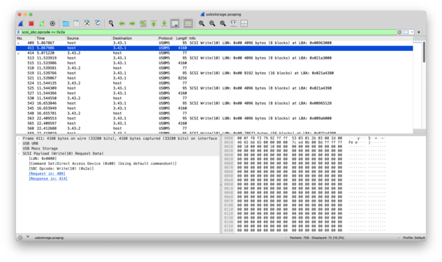

# usbstorage

```
@gehaxelt

I attached my friend's USB drive to my laptop and accidently copied a private file, which I immediately deleted. But my friend still somehow got the file from looking at the USB message their drive recorded...
```

In attachment, a pcapng file with USB Mass Storage messages is provided:



Therefore, we need to extract the data written from the pcap:

```python
import pyshark
import os

cap = pyshark.FileCapture(
    "usbstorage.pcapng", display_filter="scsi", include_raw=True, use_json=True
)
last = None
addr = 0
mapping = dict()
for pkt in cap:
    if "scsi" in pkt:
        s = str(pkt)
        if "scsi_sbc.opcode" in pkt.scsi.field_names:
            if pkt.scsi.get("scsi_sbc.opcode") == "0x2a":
                if "scsi_sbc.rdwr10.lba" in pkt.scsi.field_names:
                    print("LBA", pkt.scsi.get("scsi_sbc.rdwr10.lba"))
                    addr = int(pkt.scsi.get("scsi_sbc.rdwr10.lba"), 16) * 512
                else:
                    data = pkt.get_raw_packet()[0x40:]
                    if len(data) % 512 != 0:
                        continue
                    print(f"Write 0x{len(data):x} bytes to 0x{addr:x} (LBA 0x{addr//512:x})")
                    for i in range(0, len(data), 512):
                        mapping[addr + i] = data[i:i+512]

for key in list(sorted(mapping.keys())):
    addr = key
    if addr not in mapping:
        continue
    disk = open(f"usbstorage{addr//512:x}.img", "wb")
    while addr in mapping:
        data = mapping[addr]
        disk.write(data)
        del mapping[addr]
        addr += len(data)
```

We got the following files:

```shell
$ python3 usbstorage.py
$ file usbstorage*.img
usbstorage9a6000.img:  gzip compressed data, from Unix, original size modulo 2^32 0
usbstorage21a3000.img: data
usbstorage21a4380.img: data
usbstorage9650a8.img:  data
usbstorage963000.img:  Linux rev 1.0 ext4 filesystem data, UUID=1c2966a0-1305-415f-ac1d-8ffe4b895b71, volume name "writable" (extents) (64bit) (large files) (huge files)
usbstorage965030.img:  data
usbstorage965128.img:  data
usbstorage975128.img:  data
```

Extract the gzip to find the flag:

```shell
$ tar xvf usbstorage9a6000.img
flag.gz
$  unar flag.gz
flag.gz: Gzip
  flag... OK.
Successfully extracted to "./flag".
$ cat flag
ENO{USB_STORAGE_SHOW_ME_THE_FLAG_PLS}
```
