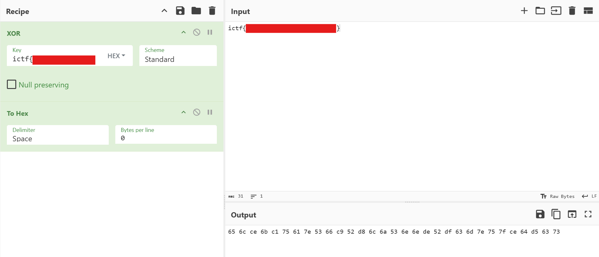

# redacted

```
by Eth007
Description

wait, i thought XORing something with itself gives all 0s???
```

Attachment:



The result is the flag, XOR with itself (ignoring non-hex part). Since the flag starts with `ictf{}`, so the XOR sequence must start with `0c0f`. First, we need to find out the key length, where `0c0f` must lead to printable characters:

```python
import itertools
result = bytes.fromhex("656cce6bc175617e5366c952d86c6a536e6ede52df636d7e757fce64d56373")
print(result, len(result))
key = [
    0x0c,
    0x0f
]

for length in range(2, 16):
    good = True
    for i, (r, k) in enumerate(zip(result, itertools.cycle(key))):
        if i % len(key) <= 1:
            if (r ^ k) < 0x20 or (r ^ k) > 0x7f:
                good = False
    if good:
        print(length)
    key.append(0)
exit(0)
```

Possible key length: 8 and 15. Lets try 8 first:

```python
import itertools
result = bytes.fromhex("656cce6bc175617e5366c952d86c6a536e6ede52df636d7e757fce64d56373")
print(result, len(result))

key = [
    0x0c,
    0x0f, # ictf{ in key
    0x00,
    0x00,
    0x00,
    0x00,
    0x00,
    0x00,
]
print(bytes(key).hex(), len(key))

output = bytearray()
for i, (r, k) in enumerate(zip(result, itertools.cycle(key))):
    output.append(r ^ k)
print(output)
```

Output:

```
b'el\xcek\xc1ua~Sf\xc9R\xd8ljSnn\xdeR\xdfcm~u\x7f\xced\xd5cs' 31
0c0f000000000000 8
bytearray(b'ic\xcek\xc1ua~_i\xc9R\xd8ljSba\xdeR\xdfcm~yp\xced\xd5cs')
```

Since we know that the flag starts with `ictf{` and ends with `}`, we can compute the part of keys:

```python
import itertools
result = bytes.fromhex("656cce6bc175617e5366c952d86c6a536e6ede52df636d7e757fce64d56373")
print(result, len(result))

key = [
    0x0c,
    0x0f, # ictf{ in key
    # ictf{ in flag
    ord('t') ^ 0xce,
    ord('f') ^ 0x6b,
    ord('{') ^ 0xc1,
    0x00,
    ord('}') ^ 0x73,
    0x00,
]
print(bytes(key).hex(), len(key))

output = bytearray()
for i, (r, k) in enumerate(zip(result, itertools.cycle(key))):
    output.append(r ^ k)
print(output)
```

Output:

```
b'el\xcek\xc1ua~Sf\xc9R\xd8ljSnn\xdeR\xdfcm~u\x7f\xced\xd5cs' 31
0c0fba0dba000e00 8
bytearray(b'ictf{uo~_is_bldSbad_ecc~yptioc}')
```

We can guess the remaining characters, e.g. `encryption`, so we can deduce the remaining key:

```python
import itertools
result = bytes.fromhex("656cce6bc175617e5366c952d86c6a536e6ede52df636d7e757fce64d56373")
print(result, len(result))

key = [
    0x0c,
    0x0f, # ictf{ in key
    # ictf{ in flag
    ord('t') ^ 0xce,
    ord('f') ^ 0x6b,
    ord('{') ^ 0xc1,
    ord('n') ^ 0x63,
    ord('}') ^ 0x73,
    ord('r') ^ 0x7e,
]
print(bytes(key).hex(), len(key))

output = bytearray()
for i, (r, k) in enumerate(zip(result, itertools.cycle(key))):
    output.append(r ^ k)
print(output)
```

Flag: `ictf{xor_is_bad_bad_encryption}`.
