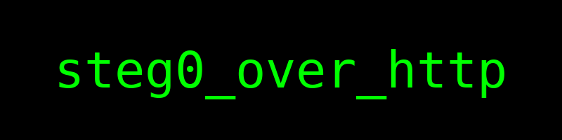

# design-portfolio

```
A slick “design portfolio” site with curated color palettes… but something feels off.
```

Open the attachment in Wireshark, we found something like:

```
X-Flag-Total: 14
X-Flag-Chunk-0013: C36...
```

Collect all the chunks in order:

```shell
strings network_capture.pcap | grep Flag | sort > temp.txt
```

Parse hex and write to file:

```python
data = bytearray()
for line in open("temp.txt", "r"):
    if "Chunk" in line:
        data += bytes.fromhex(line.split()[1])

with open(f"out.png", "wb") as f:
    f.write(data)
```

Result:



Flag is `watctf{steg0_over_http}`.
