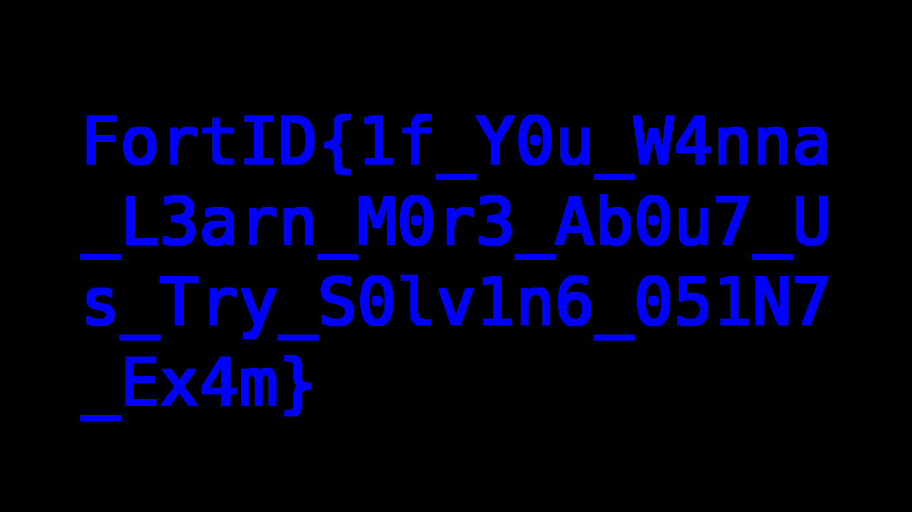

# Misc

```
This picture seems oddly familiar… but something about it feels ever so slightly off.
```

Attachment provides a webp file. We can find the original image on the website <https://fortid.com/about/>. Then, we XOR the two images:

```python
import numpy as np
from PIL import Image, ImageChops, ImageEnhance

# Open images
im1 = Image.open("about-us-team.I3TrCs6f_4E8U9.webp")
im2 = Image.open("about_us.webp")
print(im1, im2)

# Make into Numpy arrays
im1np = np.array(im1) * 255
im2np = np.array(im2) * 255

# XOR with Numpy
result = np.bitwise_xor(im1np, im2np).astype(np.uint8)

Image.fromarray(result).save("result.png")
```


To make flag clear, use `ImageEnhance.Contrast`:

```python
import numpy as np
from PIL import Image, ImageChops, ImageEnhance

# Open images
im1 = Image.open("about-us-team.I3TrCs6f_4E8U9.webp")
im2 = Image.open("about_us.webp")
print(im1, im2)

# Make into Numpy arrays
im1np = np.array(im1) * 255
im2np = np.array(im2) * 255

# XOR with Numpy
result = np.bitwise_xor(im1np, im2np).astype(np.uint8)

img = Image.fromarray(result)

ImageEnhance.Contrast(img).enhance(100).save("result.png")
```



Flag: `FortID{1f_Y0u_W4nna_L3arn_M0r3_Ab0u7_Us_Try_S0lv1n6_051N7_Ex4m}`.
