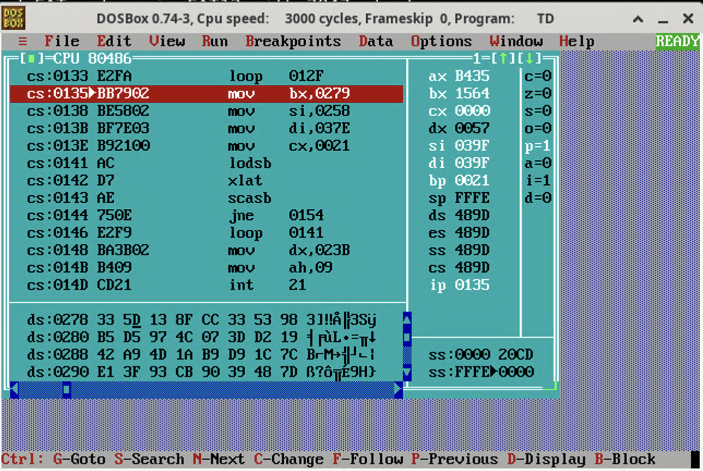

# Rev From The Past

```
Last year you've enjoyed pwning a binary from the MS-DOS era.

This year, we challenge you to reverse engineer one such binary.
```

Attachment is a DOS program that verifies flag from the command line argument. It does:

1. flag validation and copies its content to 0x258
2. prepare some data at 0x279 and 0x37e
3. for each i, verify that `0x279[0x258[i]] == 0x37e[i]`

To recover the data in memory before the check, we installed Borland C++ 3.0 in DosBox.

Installation steps:

1. Download and extract installer image from <https://winworldpc.com/download/52dfb385-9ba2-11e9-ab10-fa163e9022f0>
2. Put `disk01.img` to `disk08.img` to `~/borlandcpp`, `mkdir -p ~/borlandcpp/disk ~/borlandcpp/installer`, launch DosBox
3. Save the installation script to `~/borlandcpp/INSTALL.BAT`:

```bat
mount -u a
mount -u c
mount -u f

mount f ~/borlandcpp/installer

imgmount a ~/borlandcpp/disk01.img -t floppy
copy a:\*.* f:\
mount -u a

imgmount a ~/borlandcpp/disk02.img -t floppy
copy a:\*.* f:\
mount -u a

imgmount a ~/borlandcpp/disk03.img -t floppy
copy a:\*.* f:\
mount -u a

imgmount a ~/borlandcpp/disk04.img -t floppy
copy a:\*.* f:\
mount -u a

imgmount a ~/borlandcpp/disk05.img -t floppy
copy a:\*.* f:\
mount -u a

imgmount a ~/borlandcpp/disk06.img -t floppy
copy a:\*.* f:\
mount -u a

imgmount a ~/borlandcpp/disk07.img -t floppy
copy a:\*.* f:\
mount -u a

imgmount a ~/borlandcpp/disk08.img -t floppy
copy a:\*.* f:\
mount -u a

mount a ~/borlandcpp/installer
mount c ~/borlandcpp/system
a:

.\INSTALL.exe
```

Run the following commands in DosBox:

```
mount d ~/borlandcpp
d:
.\INSTALL.BAT
```

Follow the instructions to install Borland C++ to `C:\`. Use default options. Then, copy `CHALL.COM` in the attachment to `~/borlandcpp`, and launch the debugger using `C:\BORLANDC\BIN\TD.EXE D:\CHALL.COM`.

First, we can discover that the flag must have 31 characters between `FortID{` and `}`, so we setup the argument using dummy flag:


Then, we make a breakpoint at cs:0135, which is right before the flag validation loop:



The validation loop does:

1. mov bx,0279: set bx to 0x279
2. mov si,0258: set si to 0x258
3. mov di,037e: set di to 0x37e
4. mov cx,0021: set cx to 0x21
5. lodsb: al = *si with auto increment
6. xlat: al = *(bx + al) with auto increment
7. scasb: compare al and *di with auto increment
8. jne 0154: fail if not equal
9. loop 0141: jump to lodsb until cx decrements to zero

So it requires `0x279[0x258[i]] == 0x37e[i]`. We can find the memory content in the debugger and find the flag body:

```python
# data in 0x279
data = b"\x5d\x13\x8f\xcc\x33\x53\x98\xb5\xd5\x97\x4c\x07\x3d\xd2\x19\x42\xa9\x4d\x1a\xb9\xd9\x1c\x7c\xe1\x3f\x93\xcb\x90\x39\x48\x7d\x9e\xfb\x59\x5e\x00\x2a\xf7\xeb\xc9\x66\x8b\xd7\x44\x61\x94\xca\x69\x51\xd6\xff\x1d\x0b\x0c\x9d\xf0\x09\x7f\x92\xea\x14\x03\x45\x83\xab\x20\xf8\xa2\xe0\xc1\x70\x43\xf9\xb7\x32\x81\xc8\x35\x4e\x6f\x8e\x80\x3c\x87\x68\x95\xf2\x4b\x5a\xf3\x3b\x5f\xdc\x2d\xba\x75\x01\xe5\x8c\xaa\xd3\x5b\xd0\x99\x86\xf6\x06\x3e\x0e\xbd\x65\x15\x29\xb6\x49\xbe\xec\x37\x73\xcd\x2f\x36\x4f\xb3\xa8\xa4\x6e\x2e\x54\x18\xf4\x52\x6a\xa6\xc3"
# target in 0x37e
target = b"\x4e\x51\xcd\x75\x87\x0b\x73\x1d\x75\x87\x1d\xec\xf0\xd6\x65\x99\x0c\x75\x0b\x65\xd3\x75\xc8\x0b\x37\x65\xaa\x86\x75\xe0\x51\x51\x35"

# data[flag[i]] == target[i]
print("FortID{", end="")
for i in target:
    print(chr(data.index(i)), end="")
print("}")
```

Flag: `FortID{N0w_S4v3_S3t71ng5_4nd_L4unch_D00M}`.
