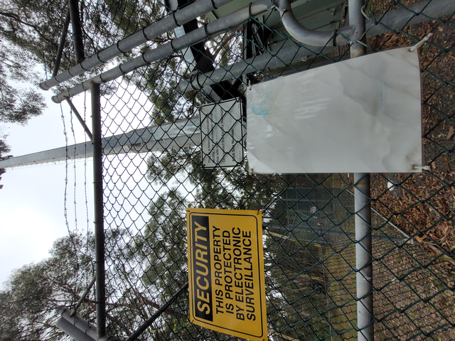

# radioactive

```
Where is this tower located?

Note: Please answer with coordinates rounded to 3 decimal places and wrap your answer with K17{}. For example, if you think that the tower is the Eiffel Tower, please submit K17{48.858,2.296}.
```



There is a `NSA Site Number: 21540061` sign. Search for it on <https://www.rfnsa.com.au/>, we got <https://www.rfnsa.com.au/2154006/detail>. It gives a location of

```
Gilbert Road
(East of Field 1 Fred Caterson Reserve),
CASTLE HILL NSW 2154
```

Following the map below, we can find the location of the same point in Google Maps. Flag: `K17{-33.717,150.987}`.
