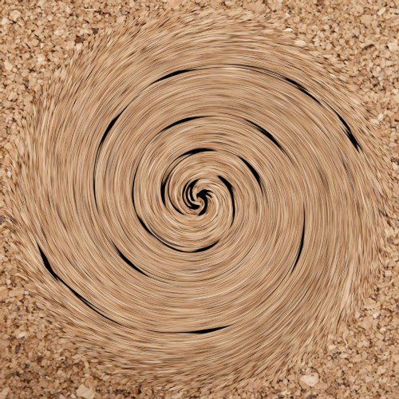
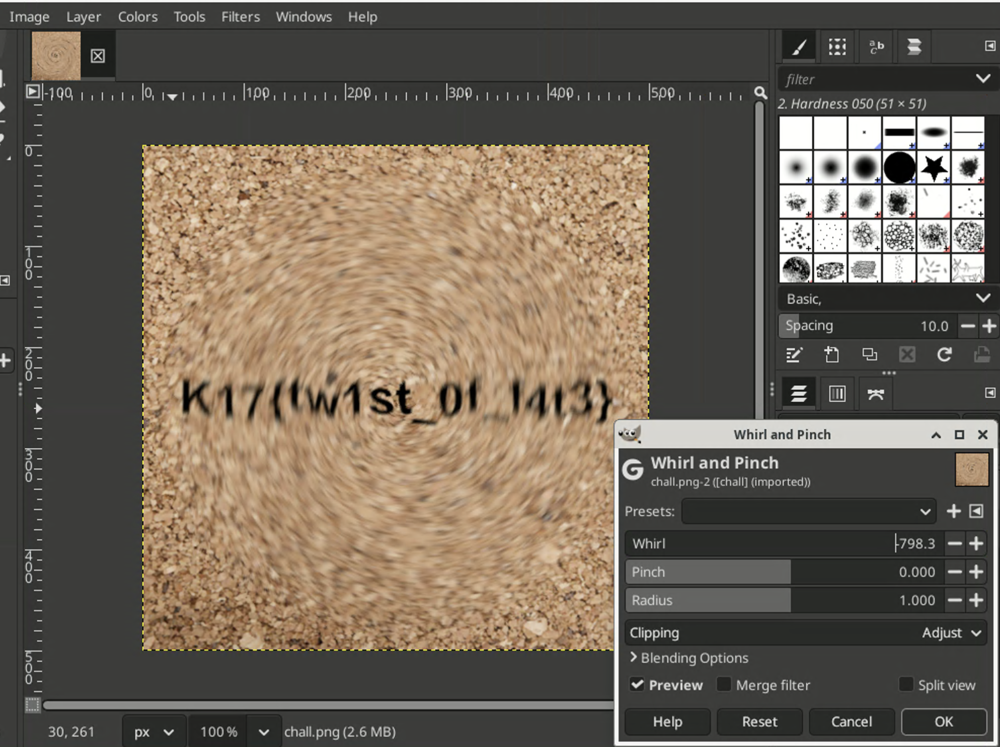

# smootie

```
I put the flag in a blender. Oops.
```



From the comment:

```shell
$ exiftool chall.png
Comment                         : Q3JlYXRlZCB3aXRoIEdJTVA=
$ echo "Q3JlYXRlZCB3aXRoIEdJTVA=" | base64 -d
Created with GIMP
```

We know that it is created with GIMP. After trying the effects in GIMP, we find the correct one and reverse the effect:



Flag: `K17{tw1st_0f_f4t3}`.
