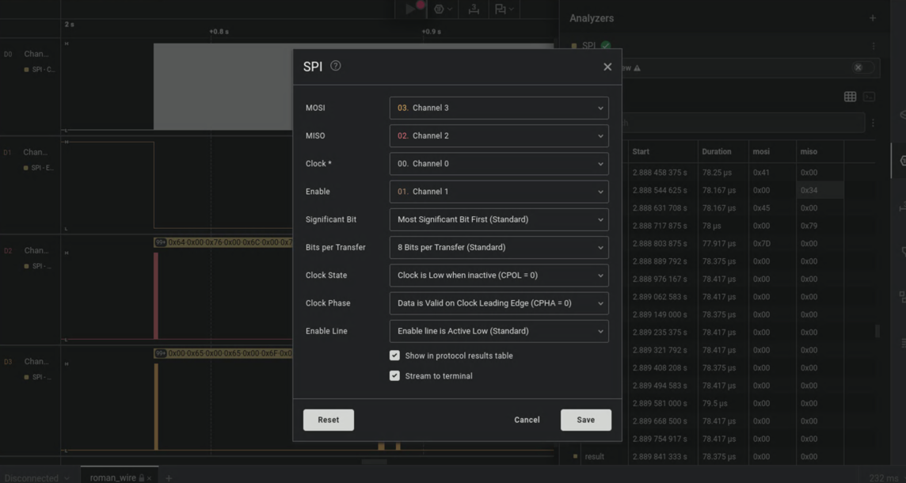

# Roman Wire

```
A Roman device speaks with a flash memory over SPI, but something feels off. Somewhere in that uneasy exchange an important data is being passed.
```

A saleae logic .sal file is provided in the attachment. Download Saleae Logic 2 from <www.saleae.com>, open the waveform, we can find a SPI waveform:



Data is transferred on both MOSI and MISO. Deinterleave and print as ascii:

```python
>>> print(bytes.fromhex("646576656c6f7065720063616e006d616e616765005265616420666c616720617320616e206f6c6420726f6d616e206d6573736167652100544c424c7b46304c315f46314c305f413445797d"))
b'developer\x00can\x00manage\x00Read flag as an old roman message!\x00TLBL{F0L1_F1L0_A4Ey}'
```

Flag is `ASIS{M0S1_M1S0_H4Lf}` after rot13.
