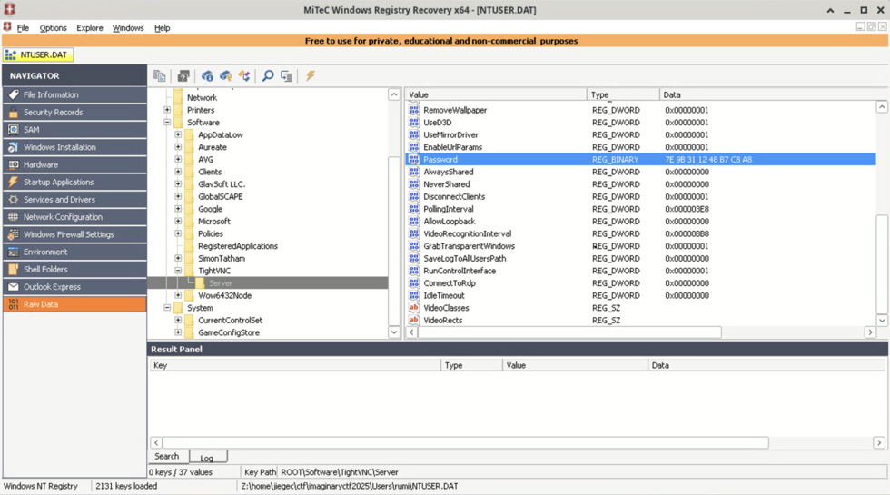

# obfuscated-1

```
by Eth007
Description

I installed every old software known to man... The flag is the VNC password, wrapped in ictf{}.
Attachments

Users.zip
```

The attachment contains a folder of `Users` under Windows. We can see there is a `NTUSER.DAT` file containing registry for the user. We can use [MiTeC Windows Registry Recovery](https://www.mitec.cz/wp/mwrr/) to open it and find the encrypted VNC password for TightVNC:



Following [frizb/PasswordDecrypts](https://github.com/frizb/PasswordDecrypts), we can decrypt the password by:

```shell
$ echo -n 7e9b311248b7c8a8 | xxd -r -p | openssl enc -provider legacy -des-cbc --nopad --nosalt -K e84ad660c4721ae0 -iv 0000000000000000 -d | hexdump -Cv
00000000  53 6c 61 79 34 55 21 21                           |Slay4U!!|
00000008
```

So the flag is `ictf{Slay4U!!}`.
