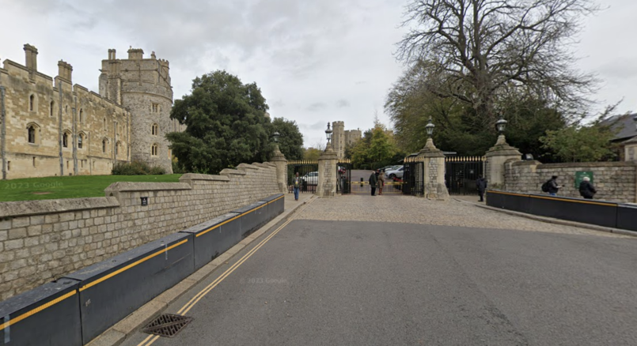

# royalvoyage

```
Look closely at the image provided.
It was taken during a journey filled with landmarks.

The interesting point in this voyage —
can you guess the beautiful place we saw here?

Use OSINT skills to analyze the image carefully.
You might find location clues, skyline hints, or reflections...

Flag format: CRACCON{your_answer_lowercase_nospace} 
```

Attachment:



Find using google image search:


Flag: `CRACCON{windsor_castle}`.
