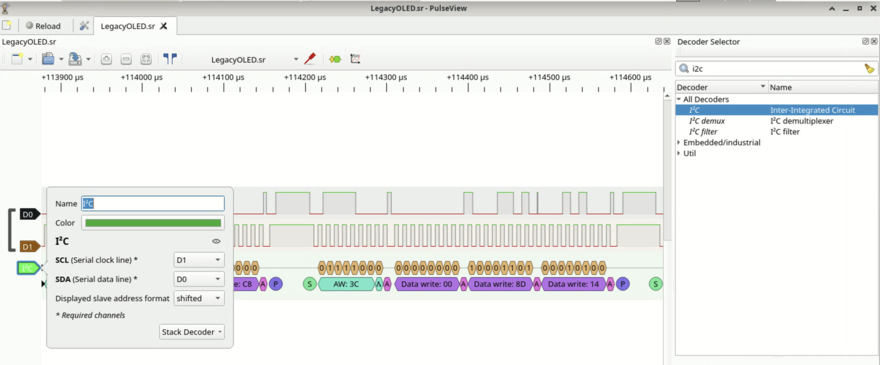

# legacyOLED

合作者：@NanoApe

附件中是一个 `LegacyOLED.sr` 文件，可以用 sigrok 的 GUI PulseView 打卡，打开以后，发现是一个 I2C 协议，用内置的 I2C decoder 进行解析：



可以看到里面的一系列的 I2C command。经过一番搜索，可以找到对应的 [SSD1306](https://cdn-shop.adafruit.com/datasheets/SSD1306.pdf) 模块的 datasheet。剩下来要做的事情就是：

1. 从 PulseView 导出 I2C decode 的结果
2. 解析 I2C，模拟 SSD1306 的功能
3. SSD1306 内部是一个 128 x 64 的点阵，通过 page 和 column 指针来索引，每次写入 8 个 bit
4. 通过解析各个命令，可以知道如何更新点阵里的值
5. 把每次操作后的点阵转化为图片保存下来

模拟器：

```python
import numpy as np
from PIL import Image


# export annotations in pulseview to annotations file
s = ""
arr = np.zeros((64, 128, 3), dtype=np.uint8)
data = bytearray()
page = 0
page_lo = 0
page_hi = 7
column = 0
column_lo = 0
column_hi = 127
mode = "page"
j = 0
for line in open("annotations"):
    if "Data write" in line:
        s += line.split()[-1]
    if "Stop" in line:
        b = bytes.fromhex(s)
        control = b[0]
        if control == 0x40:  # data
            print(f"Write {len(b)-1} bytes")
            for byte in b[1:]:
                # print(f"Write {byte} to page {page} col {column}")
                for i in range(8):
                    bit = (byte >> i) & 1
                    arr[page * 8 + i, column] = bit * 255
                if mode == "page":
                    column += 1
                    if column >= column_hi + 1:
                        column = column_lo
                elif mode == "vertical":
                    page += 1
                    if page >= page_hi + 1:
                        page = page_lo
                        column += 1
                        if column >= column_hi + 1:
                            column = column_lo
                            page = page_lo
                elif mode == "horizontal":
                    column += 1
                    if column >= column_hi + 1:
                        column = column_lo
                        page += 1
                        if page >= page_hi + 1:
                            page = page_lo
                            column = column_lo
                else:
                    assert False
        else:
            print(b.hex())
            if b[1:] == b"\xaf":
                print("Display ON")
            elif b[1:] == b"\xa1":
                print("Horizontal Flip")
            elif b[1:] == b"\xc8":
                print("Scan Reverse")
            elif b[1] >= 0xB0 and b[1] <= 0xB7:
                print(f"Set page start {b[1]-0xb0}")
                page = b[1] - 0xB0
            elif b[1:] == b"\x00":
                print("Set column lower 00")
                column = column & 0xF0
            elif b[1:] == b"\x10":
                print("Set column higher 00")
                column = column & 0x0F
            elif b[1:] == b"\x20\x01":
                print("Vertical address")
                mode = "vertical"
            elif b[1:] == b"\x20\x00":
                print("Horizontal address")
                mode = "horizontal"
            elif b[1] == 0x21:
                column_lo = b[2]
                column_hi = b[3]
                column = column_lo
                print(f"Set column address {column_lo} {column_hi}")
            elif b[1] == 0x22:
                page_lo = b[2] & 0x7
                page_hi = b[3] & 0x7
                page = page_lo
                print(f"Set page address {page_lo} {page_hi}")
            elif b[1] == 0x8D:
                print("Enable charge pump")
            else:
                print("Control", b[1:].hex())
                assert False
        s = ""

        # recover img
        j += 1
        image = Image.fromarray(arr)
        image.save(f"result-{j}.png")
        print(f"Saved to result-{j}.png")
```

运行完，可以发现最后一张图就是强网杯的 logo：


但是这里并没有 flag，所以要往回找之前的输出，发现一个比较可疑的：


@NanoApe 提示，可以用 zsteg 求解：

```shell
$ zsteg result-1095.png 
b1,r,lsb,xy         .. text: "Congratulations on your incredible success!  "
```

结果被截断了，让 `zsteg` 输出完整内容：

```shell
$ zsteg -E b1,r,lsb,xy result-1095.png
Congratulations on your incredible success!  ��� flag is qwb{Re41_Ma5te7-O5-S5Dl3o6_12C}!  You bre really smart"?��������������������������������������������?���?����?����������������LJ������������������������������?�����?�������������������������������������������������?���?��?���?��?���?���������������������������������?��
```
